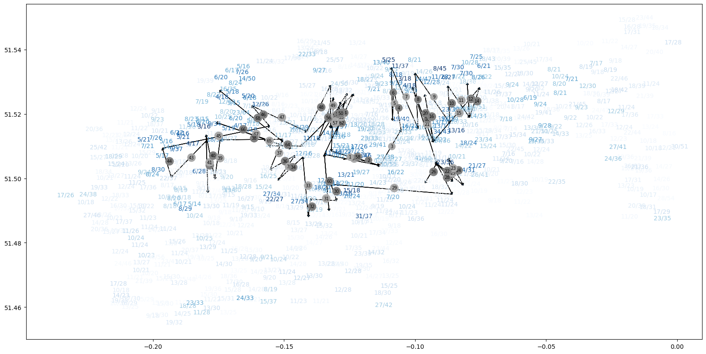

# santander-bikes
This repository includes the ongoing project of analysing the [BigQuery Santander Cycle Hire Scheme](https://console.cloud.google.com/marketplace/product/greater-london-authority/london-bicycles) dataset to gather some insights and provide useful recommendations to the Greater London Authority. The breakdown provided below depicts the tasks completed so far and the associated files used in attempting those tasks:
1. **Incorporating borough and ward information to each station**: Using the [Statistical GIS Boundary Files for London](https://data.london.gov.uk/dataset/statistical-gis-boundary-files-london) dataset, containing geographical boundaries for Greater London, the borough and ward of each station in the 'london_bicycles.cycle_stations' table was determined. The Jupyter notebook at [santander_bikes.ipynb](santander_bikes.ipynb) outlines the steps taken to achieve the task.
2. **Queries on the main dataset**: The main 'london_bicycles.cycle_hire' table, encompassing more than 80 million hires between 2015 and 2023, was then explored with BigQuery, aiming to gain a better understanding of the data. All the queries of the project, from cleaning to data aggreation and manipulation, can be found in the [queries.sql](queries.sql) file.
3. **Tableau visualisations**: The succeeding visualisations were then constructed, illustrating the bike movement among boroughs, the station locations, and the average daily bike change per year at six stations.
4. **Relocation recommendations**: The [relocation_plan.ipynb](https://nbviewer.org/github/alex-avv/santander-bikes/blob/main/relocation_plan.ipynb) Jupyter notebook includes the construction of an algorithm to plan the daily manual relocation of the bikes in 2023. This is important to ensure the smooth operation of the service, as most stations have an imbalanced daily influx-outflux of bikes. Following the mean daily influxes from 2022 and assuming we can expect similar patterns for 2023, eventually some stations will fill up while others will empty. This will disrupt some trips due to a lack of bikes at pick-up or free docks at drop-off, causing user dissatisfaction and a potential loss of users. Therefore, manually relocating the bikes is essential.

 

<noscript><a href='#'></a></noscript><object class='tableauViz'  style='display:none;'><param name='host_url' value='https%3A%2F%2Fpublic.tableau.com%2F' /> <param name='embed_code_version' value='3' /> <param name='site_root' value='' /><param name='name' value='London-SantanderBikes-2&#47;Sankey' /><param name='tabs' value='no' /><param name='toolbar' value='yes' /><param name='static_image' value='https:&#47;&#47;public.tableau.com&#47;static&#47;images&#47;Lo&#47;London-SantanderBikes-2&#47;Sankey&#47;1.png' /> <param name='animate_transition' value='yes' /><param name='display_static_image' value='yes' /><param name='display_spinner' value='yes' /><param name='display_overlay' value='yes' /><param name='display_count' value='yes' /><param name='language' value='en-US' /></object>

 

<noscript><a href='#'></a></noscript><object class='tableauViz'  style='display:none;'><param name='host_url' value='https%3A%2F%2Fpublic.tableau.com%2F' /> <param name='embed_code_version' value='3' /> <param name='site_root' value='' /><param name='name' value='London-SantanderBikes&#47;Sheet1' /><param name='tabs' value='no' /><param name='toolbar' value='yes' /><param name='static_image' value='https:&#47;&#47;public.tableau.com&#47;static&#47;images&#47;Lo&#47;London-SantanderBikes&#47;Sheet1&#47;1.png' /> <param name='animate_transition' value='yes' /><param name='display_static_image' value='yes' /><param name='display_spinner' value='yes' /><param name='display_overlay' value='yes' /><param name='display_count' value='yes' /><param name='language' value='en-US' /></object>

 

<noscript><a href='#'></a></noscript><object class='tableauViz'  style='display:none;'><param name='host_url' value='https%3A%2F%2Fpublic.tableau.com%2F' /> <param name='embed_code_version' value='3' /> <param name='site_root' value='' /><param name='name' value='London-SantanderBikes-3&#47;LineChart' /><param name='tabs' value='no' /><param name='toolbar' value='yes' /><param name='static_image' value='https:&#47;&#47;public.tableau.com&#47;static&#47;images&#47;Lo&#47;London-SantanderBikes-3&#47;LineChart&#47;1.png' /> <param name='animate_transition' value='yes' /><param name='display_static_image' value='yes' /><param name='display_spinner' value='yes' /><param name='display_overlay' value='yes' /><param name='display_count' value='yes' /><param name='language' value='en-US' /></object>

